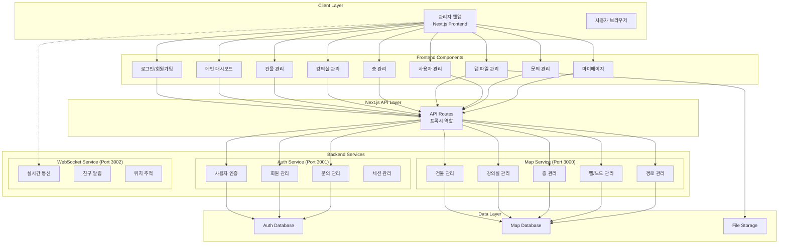
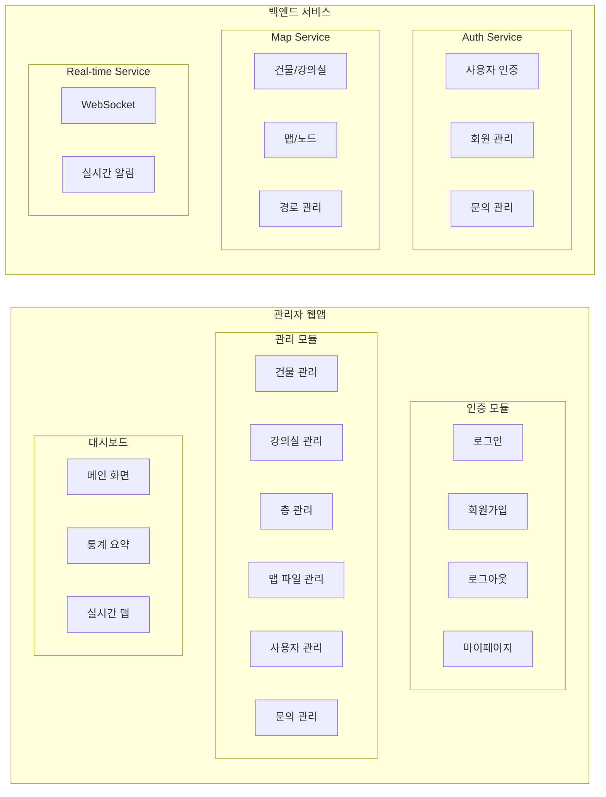
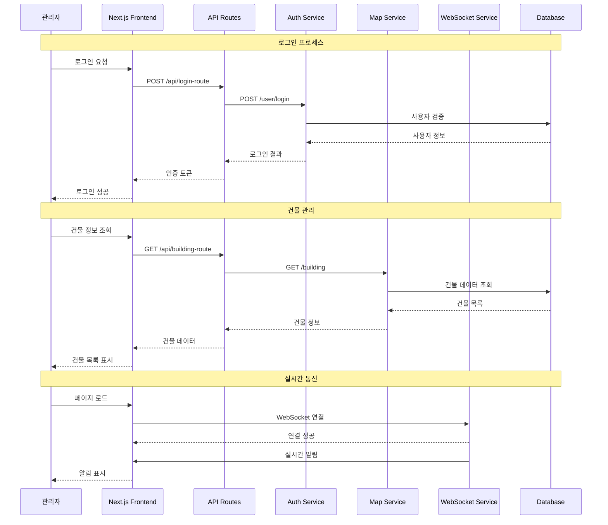
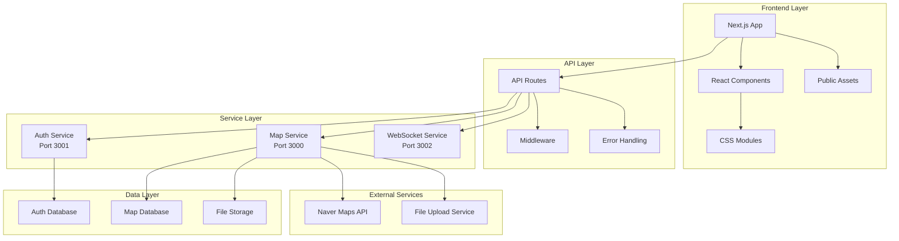
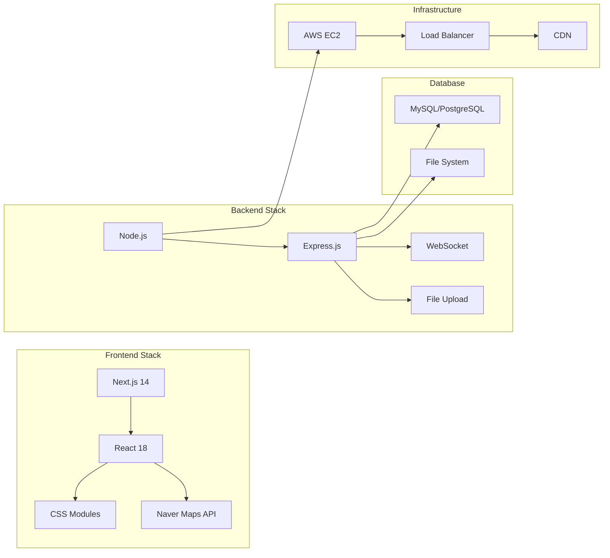
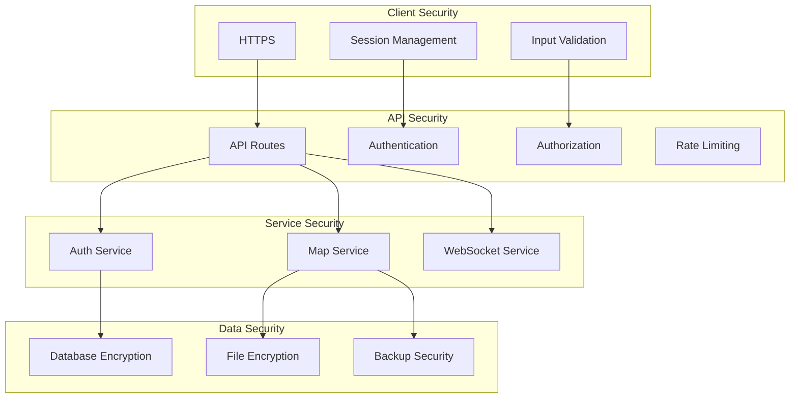

# 전체 시스템 구성도

## 시스템 전체 아키텍처

```mermaid
graph TB
    subgraph "Client Layer"
        A[관리자 웹앱<br/>Next.js Frontend]
        B[사용자 브라우저]
    end

    subgraph "Frontend Components"
        C[로그인/회원가입]
        D[메인 대시보드]
        E[건물 관리]
        F[강의실 관리]
        G[층 관리]
        H[맵 파일 관리]
        I[사용자 관리]
        J[문의 관리]
        K[마이페이지]
    end

    subgraph "Next.js API Layer"
        L[API Routes<br/>프록시 역할]
    end

    subgraph "Backend Services"
        subgraph "Auth Service (Port 3001)"
            M[사용자 인증]
            N[회원 관리]
            O[문의 관리]
            P[세션 관리]
        end

        subgraph "Map Service (Port 3000)"
            Q[건물 관리]
            R[강의실 관리]
            S[층 관리]
            T[맵/노드 관리]
            U[경로 관리]
        end

        subgraph "WebSocket Service (Port 3002)"
            V[실시간 통신]
            W[친구 알림]
            X[위치 추적]
        end
    end

    subgraph "Data Layer"
        Y[Auth Database]
        Z[Map Database]
        AA[File Storage]
    end

    A --> C
    A --> D
    A --> E
    A --> F
    A --> G
    A --> H
    A --> I
    A --> J
    A --> K

    C --> L
    D --> L
    E --> L
    F --> L
    G --> L
    H --> L
    I --> L
    J --> L
    K --> L

    L --> M
    L --> N
    L --> O
    L --> Q
    L --> R
    L --> S
    L --> T
    L --> U

    A -.-> V

    M --> Y
    N --> Y
    O --> Y
    Q --> Z
    R --> Z
    S --> Z
    T --> Z
    U --> Z
    H --> AA
```

## 기능별 모듈 구성도

```mermaid
graph LR
    subgraph "관리자 웹앱"
        subgraph "인증 모듈"
            A1[로그인]
            A2[회원가입]
            A3[로그아웃]
            A4[마이페이지]
        end

        subgraph "관리 모듈"
            B1[건물 관리]
            B2[강의실 관리]
            B3[층 관리]
            B4[맵 파일 관리]
            B5[사용자 관리]
            B6[문의 관리]
        end

        subgraph "대시보드"
            C1[메인 화면]
            C2[통계 요약]
            C3[실시간 맵]
        end
    end

    subgraph "백엔드 서비스"
        subgraph "Auth Service"
            D1[사용자 인증]
            D2[회원 관리]
            D3[문의 관리]
        end

        subgraph "Map Service"
            E1[건물/강의실]
            E2[맵/노드]
            E3[경로 관리]
        end

        subgraph "Real-time Service"
            F1[WebSocket]
            F2[실시간 알림]
        end
    end
```

## 데이터 플로우 다이어그램

```mermaid
sequenceDiagram
    participant User as 관리자
    participant Frontend as Next.js Frontend
    participant API as API Routes
    participant Auth as Auth Service
    participant Map as Map Service
    participant WS as WebSocket Service
    participant DB as Database

    Note over User, DB: 로그인 프로세스
    User->>Frontend: 로그인 요청
    Frontend->>API: POST /api/login-route
    API->>Auth: POST /user/login
    Auth->>DB: 사용자 검증
    DB-->>Auth: 사용자 정보
    Auth-->>API: 로그인 결과
    API-->>Frontend: 인증 토큰
    Frontend-->>User: 로그인 성공

    Note over User, DB: 건물 관리
    User->>Frontend: 건물 정보 조회
    Frontend->>API: GET /api/building-route
    API->>Map: GET /building
    Map->>DB: 건물 데이터 조회
    DB-->>Map: 건물 목록
    Map-->>API: 건물 정보
    API-->>Frontend: 건물 데이터
    Frontend-->>User: 건물 목록 표시

    Note over User, DB: 실시간 통신
    User->>Frontend: 페이지 로드
    Frontend->>WS: WebSocket 연결
    WS-->>Frontend: 연결 성공
    WS->>Frontend: 실시간 알림
    Frontend-->>User: 알림 표시
```

## 시스템 컴포넌트 상세도

```mermaid
graph TB
    subgraph "Frontend Layer"
        A[Next.js App]
        B[React Components]
        C[CSS Modules]
        D[Public Assets]
    end

    subgraph "API Layer"
        E[API Routes]
        F[Middleware]
        G[Error Handling]
    end

    subgraph "Service Layer"
        H[Auth Service<br/>Port 3001]
        I[Map Service<br/>Port 3000]
        J[WebSocket Service<br/>Port 3002]
    end

    subgraph "Data Layer"
        K[Auth Database]
        L[Map Database]
        M[File Storage]
    end

    subgraph "External Services"
        N[Naver Maps API]
        O[File Upload Service]
    end

    A --> B
    B --> C
    A --> D
    A --> E
    E --> F
    E --> G

    E --> H
    E --> I
    E --> J

    H --> K
    I --> L
    I --> M

    I --> N
    I --> O
```

## 기술 스택 구성도

```mermaid
graph LR
    subgraph "Frontend Stack"
        A[Next.js 14]
        B[React 18]
        C[CSS Modules]
        D[Naver Maps API]
    end

    subgraph "Backend Stack"
        E[Node.js]
        F[Express.js]
        G[WebSocket]
        H[File Upload]
    end

    subgraph "Database"
        I[MySQL/PostgreSQL]
        J[File System]
    end

    subgraph "Infrastructure"
        K[AWS EC2]
        L[Load Balancer]
        M[CDN]
    end

    A --> B
    B --> C
    B --> D

    E --> F
    F --> G
    F --> H

    F --> I
    F --> J

    E --> K
    K --> L
    L --> M
```

## 보안 및 인증 구성도

```mermaid
graph TB
    subgraph "Client Security"
        A[HTTPS]
        B[Session Management]
        C[Input Validation]
    end

    subgraph "API Security"
        D[API Routes]
        E[Authentication]
        F[Authorization]
        G[Rate Limiting]
    end

    subgraph "Service Security"
        H[Auth Service]
        I[Map Service]
        J[WebSocket Service]
    end

    subgraph "Data Security"
        K[Database Encryption]
        L[File Encryption]
        M[Backup Security]
    end

    A --> D
    B --> E
    C --> F

    D --> H
    D --> I
    D --> J

    H --> K
    I --> L
    I --> M
```
